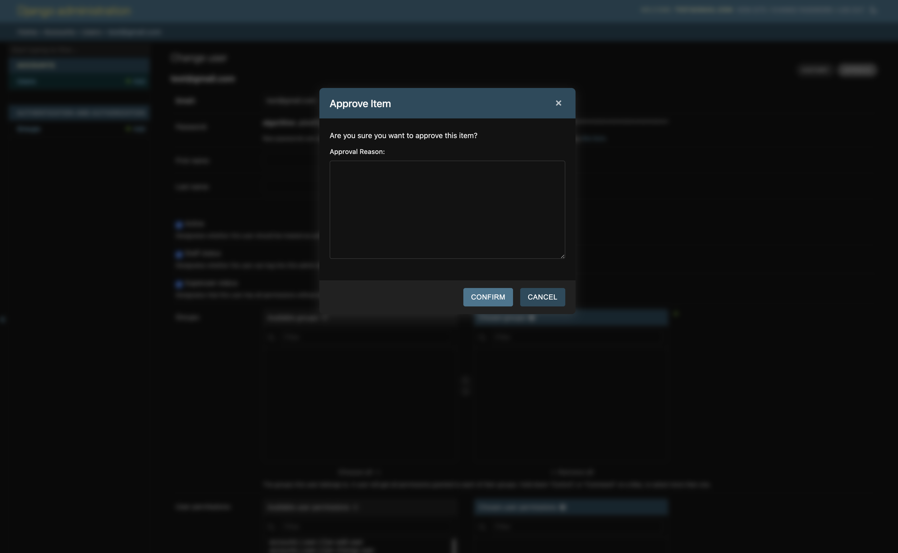
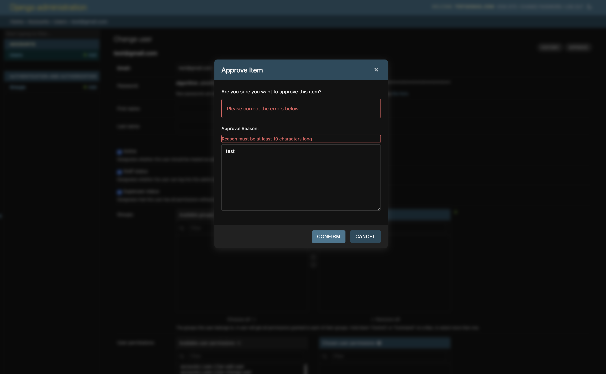

# Django Modal Actions

Django Modal Actions is a reusable Django app that provides a convenient way to add modal-based actions to your Django admin interface. It allows you to create custom actions that open in a modal dialog, enhancing the user experience and functionality of your Django admin.

<p float="left">
  
   
</p>

## Features

- Easy integration with Django admin
- Support for both list-view and object-view actions
- Customizable modal forms
- AJAX-based form submission

## Requirements

- Python (>= 3.7)
- Django (>= 3.2)

## Installation

1. Install the package using pip:

   ```
   pip install django-modal-actions
   ```

2. Add `'django_modal_actions'` to your `INSTALLED_APPS` setting:
   ```python
   INSTALLED_APPS = [
       ...
       'django_modal_actions',
       ...
   ]
   ```

## Usage

1. In your `admin.py`, import the necessary components:

   ```python
   from django.contrib import admin
   from django_modal_actions import ModalActionMixin, modal_action
   ```

2. Create a custom admin class that inherits from `ModalActionMixin` and your base admin class:

   ```python
   @admin.register(YourModel)
   class YourModelAdmin(ModalActionMixin, admin.ModelAdmin):
       list_display = ['name', 'status']
       modal_actions = ["approve"]
       list_modal_actions = ["bulk_approve"]

       @modal_action(
           modal_header="Approve Item",
           modal_description="Are you sure you want to approve this item?"
       )
       def approve(self, request, obj, form_data=None):
           obj.status = 'approved'
           obj.save()
           return f"{obj} has been approved."

       @modal_action(
           modal_header="Bulk Approve",
           modal_description="Are you sure you want to approve the selected items?"
       )
       def bulk_approve(self, request, queryset, form_data=None):
           count = queryset.update(status='approved')
           return f"{count} items have been approved."
   ```

3. If you need a custom form for your action, create a form class:

   ```python
   from django import forms

   class ApprovalForm(forms.Form):
       reason = forms.CharField(label="Approval Reason", required=True, widget=forms.Textarea)

       def clean_reason(self):
           reason = self.cleaned_data["reason"]
           if len(reason) < 10:
               raise forms.ValidationError("Reason must be at least 10 characters long")
           return reason
   ```

   Then, use it in your action:

   ```python
   @modal_action(
       modal_header="Approve with Reason",
       modal_description="Please provide a reason for approval",
       form_class=ApprovalForm
   )
   def approve_with_reason(self, request, obj, form_data=None):
       obj.status = 'approved'
       obj.approval_reason = form_data['reason']
       obj.save()
       return f"{obj} has been approved with reason: {form_data['reason']}"
   ```

## Permissions Example

You can add custom permission checks to your modal actions using the `permissions` parameter of the `modal_action` decorator. Here's an example:

```python
from django.contrib import admin
from django_modal_actions import ModalActionMixin, modal_action
from .models import YourModel

def can_approve(request, obj=None):
    return request.user.has_perm('yourapp.can_approve_items')

@admin.register(YourModel)
class YourModelAdmin(ModalActionMixin, admin.ModelAdmin):
    list_display = ['name', 'status']
    modal_actions = ['approve']

    @modal_action(
        modal_header="Approve Item",
        modal_description="Are you sure you want to approve this item?",
        permissions=can_approve
    )
    def approve(self, request, obj, form_data=None):
        obj.status = 'approved'
        obj.save()
        return f"{obj} has been approved."
```

In this example, the `can_approve` function checks if the user has the `can_approve_items` permission. The `approve` action will only be available to users who have this permission.

You can also use multiple permission checks by passing a list of functions:

```python
def is_staff(request, obj=None):
    return request.user.is_staff

@modal_action(
    modal_header="Approve Item",
    modal_description="Are you sure you want to approve this item?",
    permissions=[can_approve, is_staff]
)
def approve(self, request, obj, form_data=None):
    obj.status = 'approved'
    obj.save()
    return f"{obj} has been approved."
```

In this case, the user must both have the `can_approve_items` permission and be a staff member to see and use the approve action.

## Custom Admin Templates

If you need to customize the admin templates while still using the modal actions, you can override the `change_form_template` and `change_list_template` in your ModelAdmin class. Here's how to do it:

1. In your `admin.py`, add the `change_form_template` or `change_list_template` attribute to your ModelAdmin class:

   ```python
   @admin.register(YourModel)
   class YourModelAdmin(ModalActionMixin, admin.ModelAdmin):
       change_form_template = 'admin/yourapp/yourmodel/change_form.html'
       change_list_template = 'admin/yourapp/yourmodel/change_list.html'
       # ... rest of your ModelAdmin code
   ```

2. Create the custom template files in your app's template directory. For example:
   
   ```
   yourapp/
   └── templates/
       └── admin/
           └── yourapp/
               └── yourmodel/
                   ├── change_form.html
                   └── change_list.html
   ```

3. In your custom templates, extend the default admin templates and add the modal action buttons. Here's an example for `change_form.html`:

   ```html
   
   

   
       <ul class="object-tools">
           
               {{ block.super }}
               
                   <li>{{ modal_action_buttons }}</li>
               
           
       </ul>
   
   ```

   And for `change_list.html`:

   ```html
   
   

   
       <ul class="object-tools">
           
               {{ block.super }}
               
                   <li>{{ list_modal_action_buttons }}</li>
               
           
       </ul>
   
   ```

These custom templates will include the modal action buttons while allowing you to make other customizations to your admin interface.

## Testing

To run the tests, execute:

```
python -m unittest discover django_modal_actions/tests
```

## Contributing

Contributions are welcome! Please feel free to submit a Pull Request.

## License

This project is licensed under the MIT License.